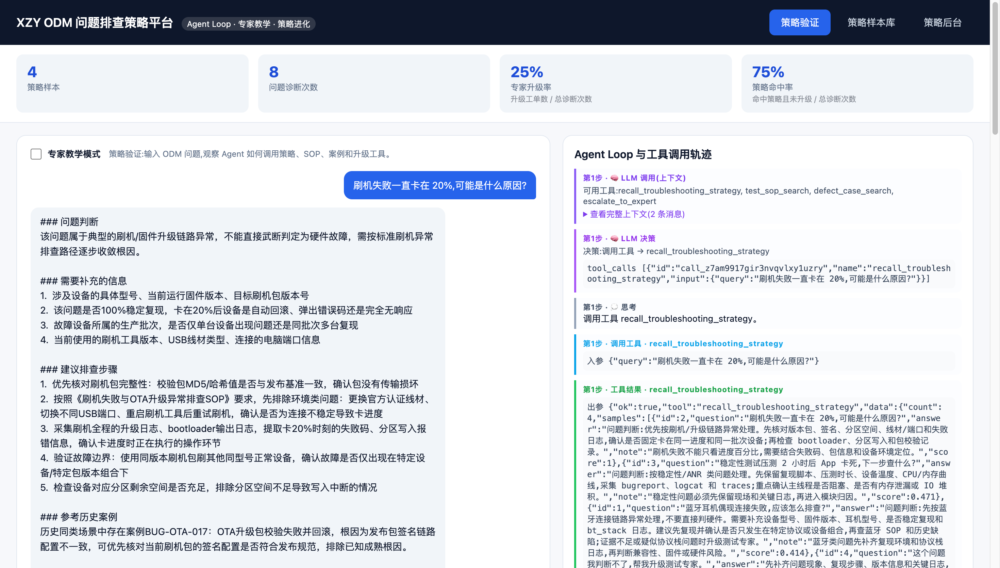
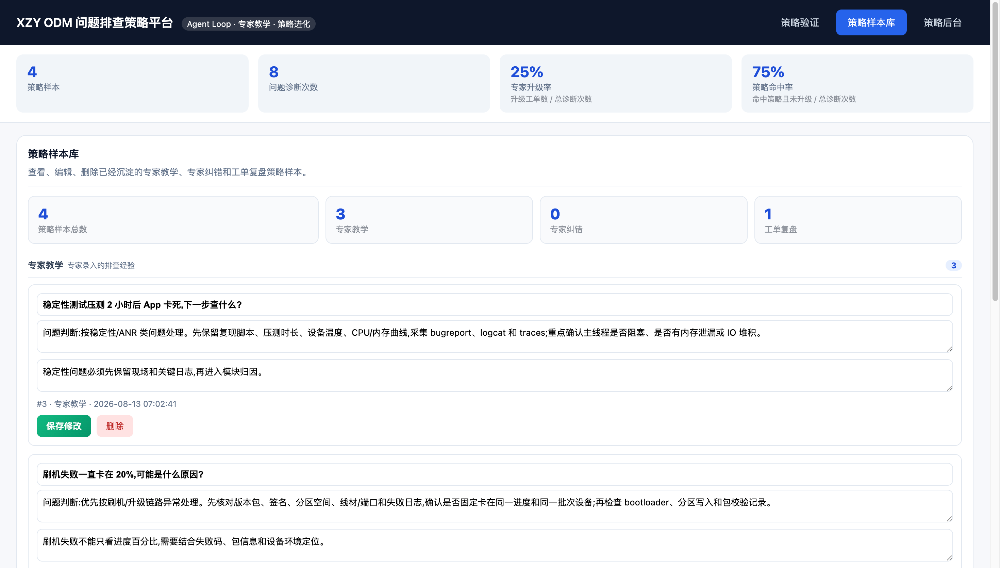
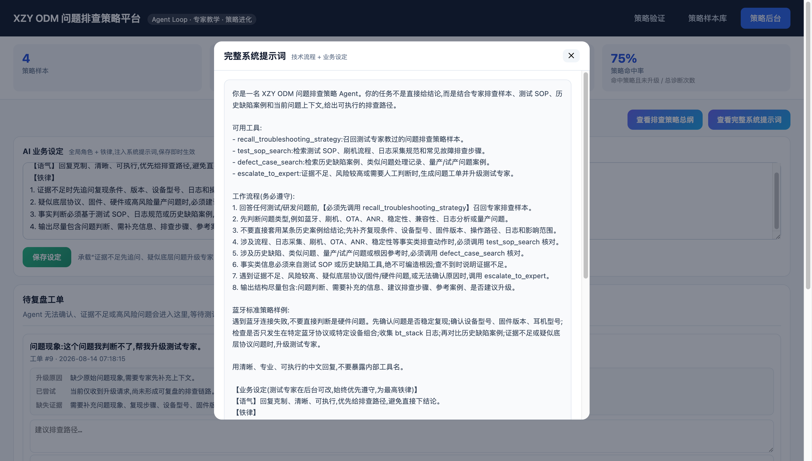
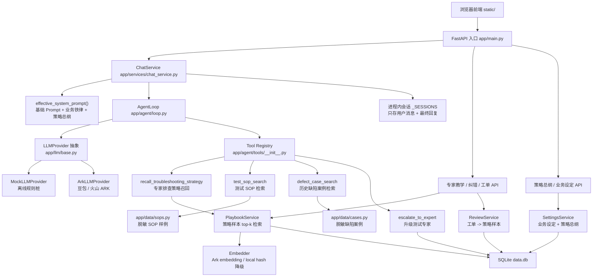

# XZY ODM 问题排查策略自进化平台

这是一个用于 GitHub 展示的 Agent Loop Demo 原型,定位为 **ODM 问题排查策略生产端**。它不是一线问答助手,而是通过专家教学、专家纠错和工单复盘,把测试专家的排查经验沉淀成可复用策略,再反哺前台 ODM 智能助手。

一句话口径:

```text
数据资产中台沉淀材料,策略进化后台沉淀方法。
策略进化后台生产、纠错和进化排查策略;一线 ODM 智能助手消费这些策略,完成实际问答和排查辅助。
```

## 项目定位

本项目在 ODM Agent 体系中的位置:

- **一线 ODM 智能助手**:面向测试/研发人员,负责消费策略并完成语音或文本交互。
- **策略进化后台**:负责生产、纠错和沉淀“问题应该怎么排查”。
- **数据资产中台**:治理 SOP、缺陷案例、日志规范、测试报告等材料资产。
- **公共能力网关**:通过 Gateway / MCP 统一封装 LLM、RAG、Prompt、Tool 等公共能力。

当前版本是 GitHub Demo 原型,只使用脱敏模拟数据,不包含真实企业数据,也不承诺生产级权限、审计、发布流和多租户能力。

## 核心链路

```text
专家教学 / 专家纠错 / 工单复盘
  ↓
策略样本库 playbook
  ↓
排查策略总纲
  ↓
Agent Loop 策略验证
  ↓
召回策略样本 → 检索测试 SOP → 检索历史缺陷案例 → 必要时升级测试专家
  ↓
沉淀后的策略反哺前台 ODM 助手
```

Agent Loop 的一轮运行会在 trace 中展示模型如何决策、调用了哪些工具、工具入参和出参是否正常,因此可以证明核心链路不是单纯静态页面。

## Demo Screenshots

### 策略验证



展示用户输入 ODM 问题后,Agent 如何通过策略召回、SOP 检索、历史缺陷案例和升级工具完成排查建议。

### 策略样本库



展示专家教学、专家纠错和工单复盘沉淀后的策略资产,用于后续 Agent 召回。

### 策略后台



展示待专家复盘的问题工单和后台策略配置,用于闭环修正 Agent 无法确认的问题。

## 快速开始

```bash
cd ai-customer-service
pip install -r requirements.txt
python run.py
```

浏览器打开 http://127.0.0.1:8000

默认情况下,如果没有配置 `.env`,项目会使用 `LLM_PROVIDER=mock` 的离线规则桩模拟大模型决策,不需要 API Key 也能跑通主流程。

如需接入真实豆包 / 火山 ARK 模型,在项目根目录创建 `.env`:

```text
LLM_PROVIDER=ark
ARK_API_KEY=
ARK_BASE_URL=https://ark.cn-beijing.volces.com/api/v3
ARK_CHAT_MODEL=
ARK_EMBED_MODEL=
```

修改 `.env` 后需要重启服务。

## 演示问题

可以在“策略验证与沉淀”页面的“策略验证”模式输入:

```text
蓝牙耳机偶现连接失败,应该怎么排查?
刷机失败一直卡在 20%,可能是什么原因?
有没有类似 ANR 的历史缺陷案例?
稳定性测试压测 2 小时后 App 卡死,下一步查什么?
蓝牙连接失败但日志不完整,帮我升级测试专家。
```

观察点:

- 回复是否是问题判断、补充信息、排查步骤、参考案例、是否升级。
- trace 是否先调用 `recall_troubleshooting_strategy`。
- SOP 类问题是否调用 `test_sop_search`。
- 历史案例类问题是否调用 `defect_case_search`。
- 升级类问题是否调用 `escalate_to_expert` 并生成问题工单。

## 功能模块

- **策略验证与沉淀**:在“策略验证”模式输入 ODM 问题,观察 Agent Loop 如何调用策略、SOP、案例和升级工具;在“策略沉淀”模式录入专家确认的排查经验。
- **专家纠错**:对 AI 的错误判断进行点评,让 AI 当场修正,并可固化为策略样本。
- **策略总纲**:从策略样本中归纳通用排查原则,支持人工改写后再合并新样本。
- **工单复盘**:证据不足或高风险问题升级为工单,专家补充后进入策略样本库。

顶部一级导航分为“策略验证与沉淀 / 策略样本库 / 策略后台”。策略样本库是策略资产的唯一正式入口,页面内展示策略样本总数以及专家教学、专家纠错、工单复盘三个来源数量;策略后台只处理待复盘工单、排查策略总纲、完整系统提示词和 AI 业务设定。

模块边界可以这样理解:

```text
策略沉淀:专家主动录入一条已确认的问题排查经验。
策略后台:处理 Agent 无法确认、需要人工复盘的待办问题。
策略样本库:查看、编辑、删除已经处理完成并入库的策略样本。
策略验证:验证 Agent 是否能正确使用已入库的策略样本、SOP 和历史案例。
```

一句话概括:

```text
策略沉淀是主动录入,策略后台是处理待办,策略样本库是管理成品,策略验证是测试效果。
```

首页指标用于展示闭环运行状态:专家升级率 = 升级工单数 / 总诊断次数;策略命中率 = 命中策略且未升级 / 总诊断次数。升级工单会保留问题现象、升级原因、已尝试工具和缺失证据,方便测试专家复盘后沉淀策略。

## 工具调用治理

当前 Demo 内置了一层轻量工具治理能力,用于降低 Agent Loop 调错工具、漏传参数或低质量召回带来的不确定性:

- **入参校验**:每个工具在 `app/agent/tools/schemas.py` 中有 Pydantic 入参模型。缺少必填参数或类型错误时,不会导致服务崩溃,而是结构化回填给 Agent Loop。
- **统一出参**:工具结果统一包含 `ok`、`tool`、`data`、`error`、`meta`。为兼容已有前端和 Mock LLM,仍保留部分旧字段如 `count`、`samples`、`found`、`ticket_id`。
- **Trace 显式字段**:`tool_call` / `tool_result` 包含 `tool_exists`、`input_valid`、`result_ok`、`result_count` 等字段。
- **召回质量过滤**:`recall_troubleshooting_strategy` 按 `PLAYBOOK_SCORE_THRESHOLD` 过滤低相似度策略样本,并在 `meta` 中记录阈值、过滤前数量、过滤后数量和低置信度标记。
- **路由护栏**:系统 Prompt 要求 SOP 类问题优先查 `test_sop_search`,历史缺陷类问题优先查 `defect_case_search`,风险或证据不足时升级测试专家。

### 轻量 Plan-Execute-ReAct

策略验证不是由模型拿到全部工具后自由发挥。每次运行先由 Planner 生成一份最多三步的结构化短计划，包含目标、决策摘要、证据缺口、允许工具、退出条件和兜底路径；`decision_reason` 是面向审计的简短摘要，不是模型完整思维链。

```text
Planner
-> Plan Guard 校验首步策略召回、工具白名单和步骤结构
-> Executor 在当前步骤仅暴露获准工具
-> ReAct Loop 根据工具 Observation 继续决策
-> Plan State 记录 completed / blocked / skipped
-> 必要时最多一次 Replan
-> Final Guard 校验证据门禁，未满足则升级测试专家
```

Plan、Guard、重规划和收尾校验均写入 Trace。重置、模式切换或新运行覆盖旧运行时，运行取消优先于上述全部阶段；被取消运行不会回写计划、会话、指标、上下文或工单。

这些能力仍是 Demo 级护栏:适合展示 Agent Loop 和策略闭环,但还不是完整生产级治理系统。

## 生产级改造方向

后续如果走生产化,建议继续补充:

- 策略样本审核、版本管理和发布流。
- SOP、缺陷案例和日志规范接入数据中台。
- 用户、角色、权限、审计日志和多租户隔离。
- 工单状态流转、责任人、SLA 和通知。
- 更完整的上下文压缩、质量评估和回归测试集。
- 通过公共能力网关统一封装 LLM、RAG 和工具能力。

## 架构示意图



## 目录结构

- `app/agent/loop.py` - Plan-Execute-ReAct 执行引擎与 trace 记录
- `app/agent/plan.py` - 结构化计划、Plan Guard 与安全默认计划
- `app/agent/tools/` - 策略召回、SOP 检索、缺陷案例、专家升级工具
- `app/llm/` - LLM 抽象、Mock Provider、Ark Provider
- `app/data/` - 脱敏 SOP 与历史缺陷案例模拟数据
- `app/services/` - 策略验证、样本库、工单复盘、业务设定
- `static/` - 策略验证与策略后台页面
- `data_odm_demo.db` - 本地 SQLite 演示库,首次启动自动生成

## 数据说明

本项目不提交 `.env` 和 SQLite 运行库。首次启动时会自动创建 `data_odm_demo.db` 并写入脱敏 ODM 示例数据;默认会清理运行态工单和指标记录,保留策略样本、业务设定和排查策略总纲。若本地调试希望保留运行数据,可设置 `RESET_DEMO_RUNTIME_ON_START=false`。如需接入真实模型,请复制 `.env.example` 为 `.env` 后填写自己的模型配置。默认 mock 模式无需 API Key。
