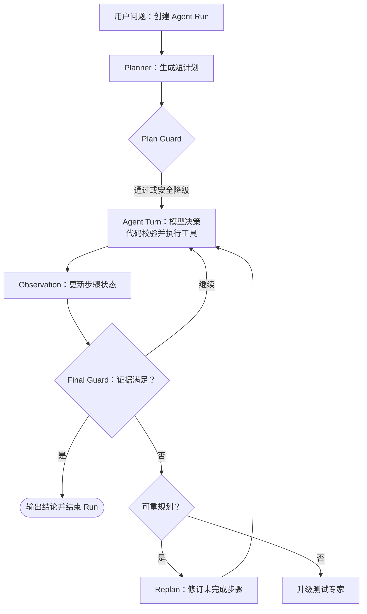

# XZY ODM 排查策略自进化平台

面向 ODM 研发测试复杂问题的 Agent Runtime Demo：
将专家排查经验沉淀为策略资产，
并在一次受控运行中形成多步排查建议或专家升级。

## 业务背景

ODM 研发测试会持续积累 SOP、历史缺陷、日志规范和复盘记录。
这些资料提供了事实依据，但面对蓝牙连接、刷机失败、稳定性异常等复杂问题，仍需要判断先查什么、还缺哪些证据，以及何时应交由专家继续处理。

本项目把这部分排查方法沉淀为可复用策略，并让 Agent 在运行中按实际观察结果调整后续动作。

## 项目定位

- **一线 ODM 智能助手**，面向测试和研发人员，提供实时问答与事实检索。
- **策略自进化后台与运行时**，沉淀专家经验，验证复杂问题的多步排查过程，并为一线助手提供策略能力。

当前仓库是使用脱敏模拟数据构建的本地 Demo，不宣称为企业生产系统。

## 核心能力

- 通过专家教学、专家纠错和工单复盘，持续沉淀可召回的排查策略样本。
- 由 Planner 为问题生成执行计划，Agent 在运行中按需查询策略、SOP 和历史案例。
- 工具结果作为 Observation 回填；证据不足时可调整路径，无法收敛时升级测试专家。
- Trace 展示关键决策、工具调用和结果，便于观察一次 Agent 运行的过程。

## 策略样本沉淀

已沉淀的策略样本分为三类：

- **专家教学**：专家在“策略沉淀”中录入问题现象、排查路径和策略原因。
- **专家纠错**：专家修正 Agent 回复后，将修正结果固化为策略。
- **工单复盘**：Agent 升级的问题由专家补充排查路径和策略原因后入库。

工单复盘遵循明确的状态转化：策略验证触发专家升级后，开放工单会出现在策略样本库顶部的“待沉淀的复盘工单”区域；该阶段不计入样本统计，也不参与总纲归纳。专家完成复盘并保存后，工单关闭，并转为“已沉淀的工单复盘”策略样本。

## 架构流程



## Demo Screenshots

### 策略验证


展示用户输入 ODM 问题后,Agent 如何通过策略召回、SOP 检索、历史缺陷案例和升级工具完成排查建议。

### 策略样本库


展示专家教学、专家纠错和工单复盘沉淀后的策略资产；待复盘工单会先在样本库顶部等待补充，保存后才进入正式样本并参与后续归纳。

### 策略后台


展示排查策略总纲、完整系统提示词和 AI 业务设定等运行时策略配置。

## 本地启动

```bash
cd ai-customer-service
pip install -r requirements.txt
./start.sh
```

浏览器打开 [http://127.0.0.1:8000](http://127.0.0.1:8000)。

未配置 `.env` 时，项目默认使用 `LLM_PROVIDER=mock` 的离线规则桩模拟模型决策，无需 API Key 即可体验完整流程。

如需接入火山 ARK 模型，在项目根目录创建 `.env` 并填入自己的配置：

```text
LLM_PROVIDER=ark
ARK_API_KEY=
ARK_BASE_URL=https://ark.cn-beijing.volces.com/api/v3
ARK_CHAT_MODEL=
ARK_EMBED_MODEL=
```

修改 `.env` 后重启服务即可生效。

## 演示问题

可在“策略验证与沉淀”页面输入以下脱敏问题：

```text
蓝牙耳机偶现连接失败，应该怎么排查？
刷机失败一直卡在 20%，可能是什么原因？
有没有类似 ANR 的历史缺陷案例？
稳定性测试压测 2 小时后 App 卡死，下一步查什么？
```

观察 Agent 是否给出问题判断、待补充信息和排查建议；也可在 Trace 中查看它如何利用策略、SOP 与案例资料。当信息不足或问题需要专家介入时，可验证工单升级闭环。

## 数据与安全说明

本仓库只包含脱敏模拟数据。请勿提交 `.env`、真实策略样本、企业 SOP、缺陷记录、日志或任何密钥。

首次启动会创建本地 SQLite 运行库并写入示例数据；Mock 模式无需网络和 API Key。

## 当前范围

当前版本聚焦单 Agent Runtime 的本地演示：策略沉淀、受控多步排查、Trace 和专家升级。权限体系、发布审核、多租户、持久化运行状态与企业网关治理属于后续部署能力。
